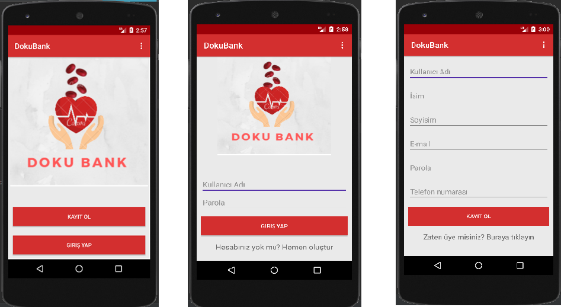
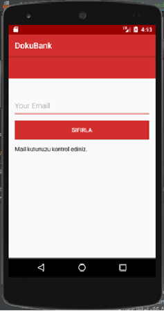
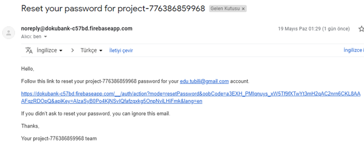
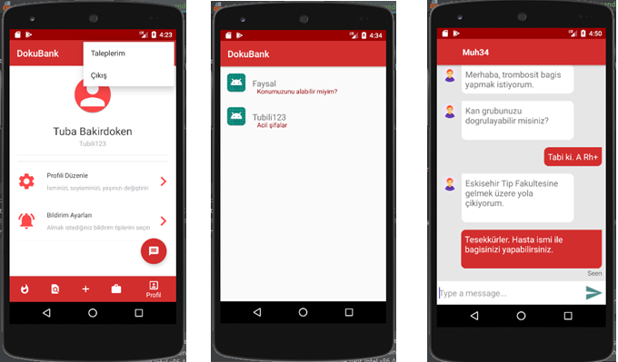
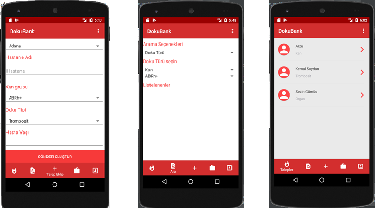
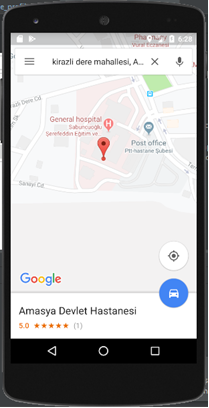

## DokuBank

DokuBank is a blood and tissue donation application.

- Java
- Firebase Authentication
- Firebase Realtime Database
- Android API Level 24

Individuals in need of tissue transplantation will be able to send notifications to anyone who uses this  application, making donation announcements and procedures easier and faster in today's living conditions.

  
   

Here is the introduction page that we can login or register to DokuBank application.

  
   

This application has reset password option. After the button click, receive a email for changing password. Firebase database provides us authentication service.

  
   

  
   

Some screenshots for chat option. You can send messages any user who created a demand.

  
   

You can also create a new demand and view all of demands. 

  
   

View the places where the request was created on the map.

